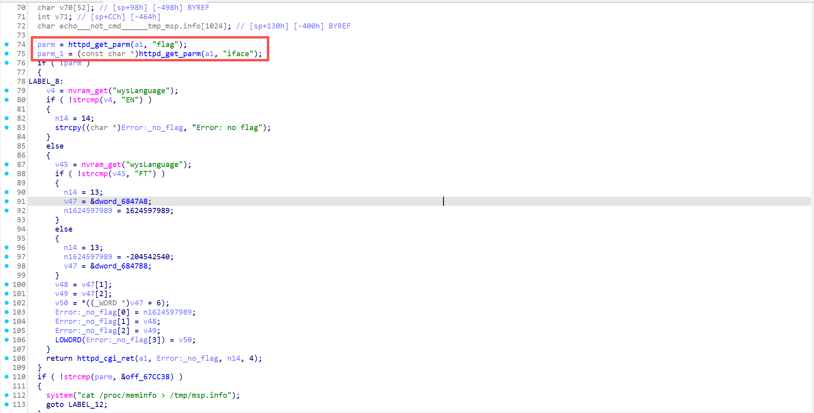
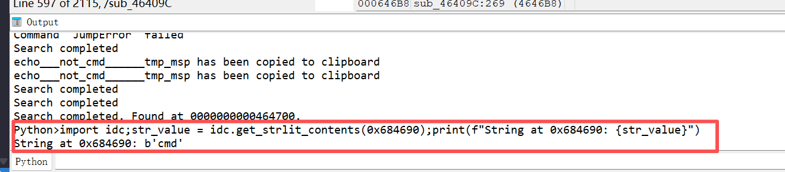
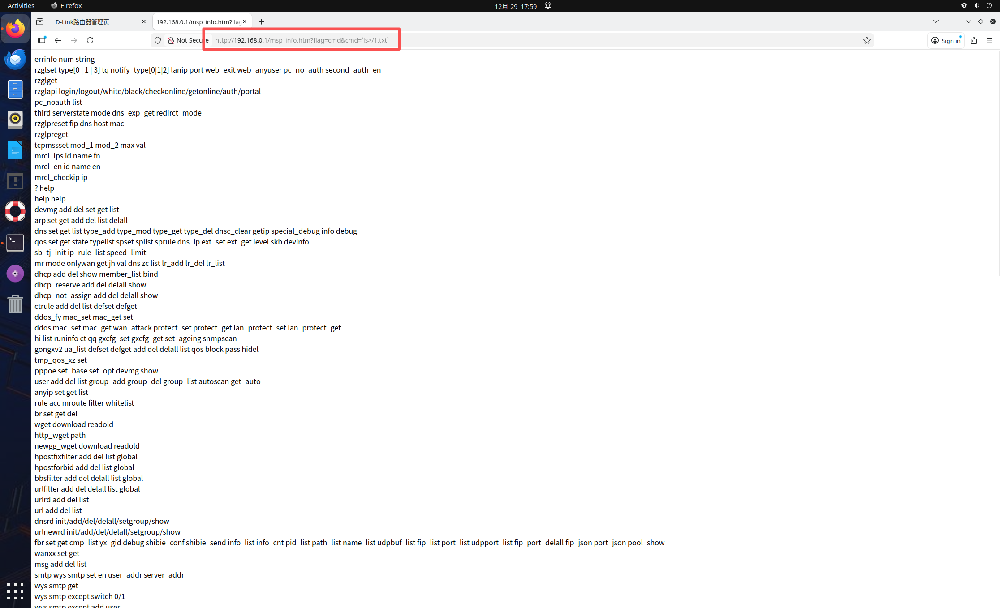
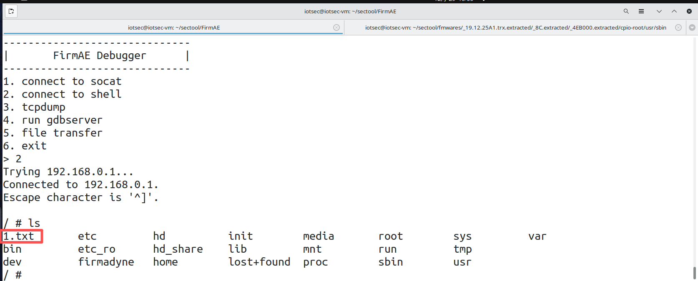

# DI_7400G+ msp_info_htm Command Injection

## Information

**Vendor of the products:**  D-Link

**Vendor's website:** https://www.dlink.com.cn/

**Affected products:** DI_7400G+

**Affected firmware version:** V19.12.25A1

**Firmware download address:** [D-Link Technical Support]([D-Link | Welcome](https://www.dlink.com.cn/techsupport/ProductInfo.aspx?m=DI-7400G%2B))

## Overview

A validation command execution vulnerability was discovered in D-Link's related product DI_7400G+, which can be exploited by attackers by sending malicious HTTP GET packets to cause arbitrary command execution, which can be triggered when the request path is `/msp_info.htm`

## Vulnerability details

The API for invoking the function


Locate to the function `msp_info_htm`, and the function takes values for flag and iface



Here is the value of cmd




When the value of cmd is not empty, it will be spliced and then the system command will be executed. The prerequisite is having permission to log in to the system.

## POC

```
http://192.168.0.1/msp_info.htm?flag=cmd&cmd=`ls%3E/1.txt`
```




